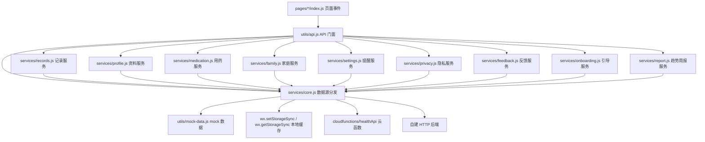

# 康小记项目结构阅读指南

本文用于快速理解当前微信小程序项目。建议先读本文，再按“页面 -> API 门面 -> services -> mock/缓存/云函数”的顺序阅读代码。

## 1. 项目定位

康小记是一个家庭健康记录工具，核心功能包括：

- 血压、血糖记录
- 用药计划和用药确认
- 提醒中心和提醒设置
- 家属邀请、加入家庭、授权范围管理
- 趋势、历史记录、周报
- 隐私政策、用户服务协议、数据管理和反馈

合规口径：本项目只做记录、提醒、趋势回顾和按授权共享，不提供诊断、治疗、处方、用药决策或急救判断。

## 2. 目录总览

```text
D:\CursorWorkspace\xiaochengxu
├─ app.js                         小程序全局入口，存放 appName、隐私版本等全局配置
├─ app.json                       页面路由、窗口样式、tabBar 配置
├─ app.wxss                       全局样式
├─ components                     复用组件
│  ├─ big-number-input            大号数字输入组件
│  ├─ fixed-action                底部固定主按钮
│  ├─ metric-card                 指标卡片
│  ├─ notice-bar                  提示条
│  └─ quick-action                快捷入口
├─ docs                           项目文档、PRD、原型和云开发说明
│  ├─ 项目结构阅读指南.md          当前阅读地图
│  ├─ 云开发数据库Schema设计文档.md 云数据库集合、字段、索引和切云检查清单
│  ├─ 云开发控制台初始化清单.md     云开发控制台创建集合和索引的手工清单
│  ├─ 健康管理微信小程序MVP产品需求文档.md
│  ├─ 健康管理微信小程序MVP技术开发任务清单.md
│  ├─ 健康管理微信小程序MVP原型页面说明与交互稿.md
│  ├─ 健康管理微信小程序MVP可点击原型.html
│  └─ 其他市场分析和原始方案文档
├─ pages                          小程序页面
├─ services                       业务服务层，按领域拆分
│  ├─ core.js                     数据源切换、本地缓存、云函数/HTTP 分发
│  ├─ records.js                  血压/血糖记录
│  ├─ profile.js                  基础资料、我的页、首页称呼合并
│  ├─ medication.js               用药计划、用药确认和用药状态合并
│  ├─ family.js                   家庭、邀请、加入、家属授权
│  ├─ settings.js                 提醒中心、提醒设置、免打扰
│  ├─ privacy.js                  隐私确认、隐私政策、用户协议、授权设置
│  ├─ data-rights.js              数据导出、健康数据删除、账号清空
│  ├─ feedback.js                 帮助中心、意见反馈
│  ├─ onboarding.js               角色选择等新手引导配置
│  └─ report.js                   趋势页、健康记录周报
├─ utils
│  ├─ api.js                      页面统一 API 门面
│  ├─ api-config.js               local/cloud/http 数据源配置
│  ├─ mock-data.js                全页面 mock 数据
│  ├─ page-factory.js             统一跳转和弹窗
│  └─ routes.js                   业务路由键到真实页面路径的映射
├─ cloudfunctions
   └─ healthApi
      ├─ index.js                 微信云函数接口入口
      ├─ perf.js                  统一 timing log 规范
      ├─ static-pages.js          隐私协议、新手引导等静态页数据
      ├─ record-service.js        记录录入配置、详情、列表、趋势
      ├─ medication-service.js    用药列表、编辑、确认和计划写入
      ├─ family-service.js        家庭首页、邀请、加入和授权管理
      ├─ settings-data-service.js 提醒设置、隐私设置、数据管理和反馈
      ├─ daily-stats-service.js   健康记录预聚合统计
      └─ report-service.js        周报统计
└─ scripts
   └─ health-api-regression.js    云函数 service 脚本级回归
```

## 3. 推荐阅读顺序

1. 先读 [app.json](D:/CursorWorkspace/xiaochengxu/app.json)，理解页面注册顺序和 tabBar。
2. 再读 [utils/routes.js](D:/CursorWorkspace/xiaochengxu/utils/routes.js) 和 [utils/page-factory.js](D:/CursorWorkspace/xiaochengxu/utils/page-factory.js)，理解页面如何跳转。
3. 读 [utils/api.js](D:/CursorWorkspace/xiaochengxu/utils/api.js)，理解页面统一调用哪些接口。
4. 按领域读 `services`：
   - [services/records.js](D:/CursorWorkspace/xiaochengxu/services/records.js)：血压/血糖记录
   - [services/profile.js](D:/CursorWorkspace/xiaochengxu/services/profile.js)：基础资料和我的页
   - [services/medication.js](D:/CursorWorkspace/xiaochengxu/services/medication.js)：用药计划和确认
   - [services/family.js](D:/CursorWorkspace/xiaochengxu/services/family.js)：家庭协同
   - [services/settings.js](D:/CursorWorkspace/xiaochengxu/services/settings.js)：提醒中心和提醒设置
   - [services/privacy.js](D:/CursorWorkspace/xiaochengxu/services/privacy.js)：隐私政策、用户协议和授权设置
   - [services/feedback.js](D:/CursorWorkspace/xiaochengxu/services/feedback.js)：帮助中心和意见反馈
   - [services/onboarding.js](D:/CursorWorkspace/xiaochengxu/services/onboarding.js)：角色选择等新手引导配置
   - [services/report.js](D:/CursorWorkspace/xiaochengxu/services/report.js)：趋势页和健康记录周报
   - [services/core.js](D:/CursorWorkspace/xiaochengxu/services/core.js)：本地缓存和数据源切换
5. 最后读 [utils/mock-data.js](D:/CursorWorkspace/xiaochengxu/utils/mock-data.js)，对照页面看每个字段如何展示。
6. 如果准备切云开发，先读 [云开发数据库Schema设计文档.md](D:/CursorWorkspace/xiaochengxu/docs/云开发数据库Schema设计文档.md) 和 [云开发控制台初始化清单.md](D:/CursorWorkspace/xiaochengxu/docs/云开发控制台初始化清单.md)，再读 [cloudfunctions/healthApi/index.js](D:/CursorWorkspace/xiaochengxu/cloudfunctions/healthApi/index.js)。

## 4. 数据流地图



当前默认数据源在 [utils/api-config.js](D:/CursorWorkspace/xiaochengxu/utils/api-config.js)：

```js
dataSource: 'local'
```

含义：

- `local`：读取 `mock-data.js`，写入 `wx.setStorageSync`，适合当前本地 MVP。
- `cloud`：读写走微信云函数 `healthApi`。
- `http`：读写走自建后端 `httpBaseUrl`。

## 5. 页面路由地图

| 页面路径 | 页面名称 | 主要职责 | 主要 API |
|---|---|---|---|
| `pages/privacy/index` | 隐私确认 | 首次进入，确认隐私政策和用户协议 | `getPrivacyData()` |
| `pages/privacy-detail/index` | 隐私摘要 | 兼容早期隐私摘要页 | `getPrivacyDetailData()` |
| `pages/privacy-policy/index` | 隐私政策 | 展示完整隐私政策 | `getPrivacyPolicyData()` |
| `pages/user-agreement/index` | 用户服务协议 | 展示服务边界和使用规则 | `getUserAgreementData()` |
| `pages/role/index` | 角色选择 | 本人使用或帮家人管理 | `getRoleData()` |
| `pages/family-join-hint/index` | 等待邀请 | 帮家人管理的加入说明 | `getFamilyJoinHintData()` |
| `pages/profile/index` | 基础资料 | 称呼、角色、关注项目 | `getProfileData()`、`saveProfile()` |
| `pages/home/index` | 首页 | 今日待办、快捷记录、最新指标 | `getHomeData()` |
| `pages/home-family/index` | 家属首页 | 家属账号查看被授权记录 | `getHomeFamilyData()` |
| `pages/record-bp/index` | 记血压 | 血压表单、校验、保存 | `getRecordBpData()`、`saveBloodPressureRecord()` |
| `pages/record-bg/index` | 记血糖 | 血糖表单、校验、保存 | `getRecordBgData()`、`saveBloodGlucoseRecord()` |
| `pages/record-detail/index` | 记录详情 | 最新记录详情和删除入口 | `getRecordDetailData()` |
| `pages/record-list/index` | 历史记录 | 按血压/血糖筛选历史 | `getRecordListData()` |
| `pages/med-list/index` | 用药计划 | 今日确认项和计划列表 | `getMedListData()` |
| `pages/med-edit/index` | 添加/编辑用药 | 药名、剂量、提醒时间 | `getMedEditData()`、`saveMedicationPlan()` |
| `pages/med-confirm/index` | 用药确认 | 已服、稍后提醒、跳过 | `getMedConfirmData()`、`confirmMedication()` |
| `pages/trend/index` | 趋势 | 指标和时间范围切换 | `getTrendData()` |
| `pages/family/index` | 家庭 | 家属列表和邀请入口 | `getFamilyData()` |
| `pages/family-invite/index` | 邀请家属 | 关系、授权范围、分享文案 | `getFamilyInviteData()`、`createFamilyInvite()` |
| `pages/family-join/index` | 加入家庭 | 家属确认边界并加入 | `getFamilyJoinData()`、`joinFamilyByInvite()` |
| `pages/family-auth/index` | 授权管理 | 家属权限和提醒规则 | `getFamilyAuthData()`、`updateFamilyAuth()` |
| `pages/report/index` | 周报 | 周记录汇总和分享入口 | `getReportData()` |
| `pages/reminder/index` | 提醒中心 | 今天/近7天/已完成任务 | `getReminderData()` |
| `pages/me/index` | 我的 | 资料摘要和设置入口 | `getMeData()` |
| `pages/reminder-settings/index` | 提醒设置 | 提醒开关、免打扰 | `getReminderSettingsData()`、`saveReminderSettings()` |
| `pages/privacy-settings/index` | 隐私与授权 | 授权项目和授权日志 | `getPrivacySettingsData()`、`updatePrivacySettings()` |
| `pages/data/index` | 数据管理 | 数据范围、导出、删除 | `getDataManagementData()` |
| `pages/help/index` | 帮助中心 | 快捷入口和 FAQ | `getHelpData()` |
| `pages/feedback/index` | 意见反馈 | 反馈类型、内容、联系方式 | `getFeedbackData()`、`submitFeedback()` |

## 6. API 门面和服务边界

页面统一从 [utils/api.js](D:/CursorWorkspace/xiaochengxu/utils/api.js) 导入接口，页面不直接访问 `services`。

| 领域 | 文件 | 负责内容 |
|---|---|---|
| 通用底座 | `services/core.js` | `resolveMockData()`、`resolveRemote()`、本地缓存读写、云函数和 HTTP 分发 |
| 记录 | `services/records.js` | 血压/血糖保存、历史记录、记录详情、数据管理记录数 |
| 资料 | `services/profile.js` | 基础资料保存、首页称呼合并、我的页资料合并 |
| 用药 | `services/medication.js` | 用药计划、用药确认、首页/提醒中心/家属页用药状态合并 |
| 家庭 | `services/family.js` | 家属邀请、加入家庭、家庭页、家属权限 |
| 提醒 | `services/settings.js` | 提醒中心、提醒设置、本地提醒开关合并 |
| 隐私 | `services/privacy.js` | 隐私确认、隐私政策、用户服务协议、隐私授权设置 |
| 反馈 | `services/feedback.js` | 帮助中心、意见反馈、本地反馈保存 |
| 引导 | `services/onboarding.js` | 角色选择等进入主流程前的配置 |
| 趋势周报 | `services/report.js` | 趋势页、健康记录周报 |
| 门面 | `utils/api.js` | 汇总导出页面 API，并保留首页、家属首页等少量跨领域组合 |

## 7. 本地缓存 key 对照表

缓存 key 定义在 [services/core.js](D:/CursorWorkspace/xiaochengxu/services/core.js) 的 `STORAGE_KEYS`。

| key 名 | 实际缓存 key | 主要内容 | 写入接口 | 主要读取位置 |
|---|---|---|---|---|
| `profile` | `user_profile_v1` | 用户称呼、角色、关注项目 | `saveProfile()` | `getProfileData()`、`getHomeData()`、`getMeData()` |
| `records` | `health_records_v1` | 血压、血糖记录 | `saveBloodPressureRecord()`、`saveBloodGlucoseRecord()` | `getRecordListData()`、`getRecordDetailData()`、`getDataManagementData()` |
| `dailyStats` | 暂无本地缓存 | 云端健康记录日统计 | `saveBloodPressureRecord()`、`saveBloodGlucoseRecord()`、`deleteRecord()`、`rebuildRecordStats()` | `getHomeData()`、`getReportData()` |
| `recordStats` | 暂无本地缓存 | 云端健康记录累计统计 | `saveBloodPressureRecord()`、`saveBloodGlucoseRecord()`、`deleteRecord()`、`rebuildRecordStats()` | `getHomeData()` |
| `medicationPlans` | `medication_plans_v1` | 用药计划 | `saveMedicationPlan()` | `getMedListData()`、`getMedEditData()`、`getMedConfirmData()` |
| `medicationConfirmations` | `medication_confirmations_v1` | 用药确认、跳过、稍后提醒 | `confirmMedication()` | `getHomeData()`、`getMedListData()`、`getReminderData()`、`getHomeFamilyData()` |
| `familyAuth` | `family_auth_v1` | 家属授权范围和提醒规则 | `updateFamilyAuth()` | `getFamilyData()`、`getFamilyAuthData()` |
| `familyMembers` | 暂无本地缓存 | 云端家庭成员关系 | `joinFamilyByInvite()` | `getHomeFamilyData()`、`getFamilyData()` |
| `reminderSettings` | `reminder_settings_v1` | 提醒开关、免打扰 | `saveReminderSettings()` | `getReminderData()`、`getReminderSettingsData()` |
| `privacySettings` | `privacy_settings_v1` | 隐私授权开关和日志 | `updatePrivacySettings()` | `getPrivacySettingsData()` |
| `feedbacks` | `feedbacks_v1` | 意见反馈记录 | `submitFeedback()` | 当前主要用于本地保存，后续可在后台管理中读取 |

## 8. 云函数读接口 key 对照表

前端在 `dataSource: 'cloud'` 时，通过 `services/core.js` 调用云函数：

```js
wx.cloud.callFunction({
  name: 'healthApi',
  data: { key, payload }
})
```

云函数主入口位于 [cloudfunctions/healthApi/index.js](D:/CursorWorkspace/xiaochengxu/cloudfunctions/healthApi/index.js)。

| key | 前端函数 | 云函数当前支持 | 说明 |
|---|---|---:|---|
| `privacy` | `getPrivacyData()` | 是 | 静态隐私确认数据，云端由 `static-pages.js` 提供 |
| `privacyDetail` | `getPrivacyDetailData()` | 是 | 旧隐私摘要页 |
| `privacyPolicy` | `getPrivacyPolicyData()` | 是 | 隐私政策正文 |
| `userAgreement` | `getUserAgreementData()` | 是 | 用户服务协议正文 |
| `role` | `getRoleData()` | 是 | 角色选择静态数据 |
| `familyJoinHint` | `getFamilyJoinHintData()` | 是 | 等待邀请静态说明 |
| `home` | `getHomeData()` | 是 | 首页数据 |
| `homeFamily` | `getHomeFamilyData()` | 是 | 家属首页 |
| `profile` | `getProfileData()` | 是 | 基础资料 |
| `recordBp` | `getRecordBpData()` | 是 | 血压录入配置 |
| `recordBg` | `getRecordBgData()` | 是 | 血糖录入配置 |
| `recordDetail` | `getRecordDetailData()` | 是 | 记录详情 |
| `recordList` | `getRecordListData()` | 是 | 记录列表 |
| `medList` | `getMedListData()` | 是 | 用药列表 |
| `medEdit` | `getMedEditData()` | 是 | 用药编辑 |
| `medConfirm` | `getMedConfirmData()` | 是 | 用药确认 |
| `trend` | `getTrendData()` | 是 | 趋势数据 |
| `family` | `getFamilyData()` | 是 | 家庭页 |
| `familyInvite` | `getFamilyInviteData()` | 是 | 邀请家属 |
| `familyJoin` | `getFamilyJoinData()` | 是 | 加入家庭 |
| `familyAuth` | `getFamilyAuthData()` | 是 | 家属权限 |
| `report` | `getReportData()` | 是 | 周报 |
| `reminder` | `getReminderData()` | 是 | 提醒中心 |
| `reminderSettings` | `getReminderSettingsData()` | 是 | 提醒设置 |
| `me` | `getMeData()` | 是 | 我的页 |
| `privacySettings` | `getPrivacySettingsData()` | 是 | 隐私授权设置 |
| `dataManagement` | `getDataManagementData()` | 是 | 数据管理 |
| `help` | `getHelpData()` | 是 | 帮助中心 |
| `feedback` | `getFeedbackData()` | 是 | 反馈页 |

切云提醒：

- `services/core.js` 对云端读请求做 12 秒短缓存和同请求合并；写接口成功后会清空读缓存，避免保存后继续展示旧数据。
- `updatePrivacySettings` 已按前端 `permissions / links / logs` 对齐，云函数不再保留旧版 `settings` 字段。
- 云函数 timing log 统一由 `cloudfunctions/healthApi/perf.js` 输出，日志前缀为 `[healthApi:perf:v1]`，JSON 字段固定为 `schemaVersion / event / timestamp / routeType / route / step / durationMs / count / ok / error`。

## 9. 云函数写接口 action 对照表

前端写接口在 `dataSource: 'cloud'` 时，通过：

```js
wx.cloud.callFunction({
  name: 'healthApi',
  data: { action, payload }
})
```

| action | 前端函数 | 云函数当前支持 | 主要集合 | 说明 |
|---|---|---:|---|---|
| `saveBloodPressureRecord` | `saveBloodPressureRecord()` | 是 | `health_records` | 保存血压记录 |
| `saveBloodGlucoseRecord` | `saveBloodGlucoseRecord()` | 是 | `health_records` | 保存血糖记录 |
| `saveProfile` | `saveProfile()` | 是 | `profiles` | 保存或更新基础资料 |
| `saveMedicationPlan` | `saveMedicationPlan()` | 是 | `medication_plans` | 新增或更新用药计划 |
| `deleteMedicationPlan` | 前端门面暂未暴露 | 是 | `medication_plans` | 删除用药计划 |
| `confirmMedication` | `confirmMedication()` | 是 | `medication_confirmations` | 保存用药确认状态 |
| `updateFamilyAuth` | `updateFamilyAuth()` | 是 | `family_auth` | 保存家属授权 |
| `createFamilyInvite` | `createFamilyInvite()` | 是 | `family_auth` | 创建一次性家庭邀请码 |
| `joinFamilyByInvite` | `joinFamilyByInvite()` | 是 | `family_members` | 家属账号通过邀请码加入家庭 |
| `revokeFamilyMember` | `revokeFamilyMember()` | 是 | `family_auth`、`family_members` | 解除家属授权并同步撤销关系 |
| `exportUserData` | `exportUserData()` | 是 | 全部用户相关集合 | 导出当前用户个人数据 JSON |
| `deleteUserData` | `deleteUserData()` | 是 | `health_records`、`medication_confirmations`、统计集合 | 删除健康数据和关联统计 |
| `clearUserAccount` | `clearUserAccount()` | 是 | 全部用户相关集合 | 清空账号数据并撤销家庭关系 |
| `saveReminderSettings` | `saveReminderSettings()` | 是 | `reminder_settings` | 保存提醒设置 |
| `updatePrivacySettings` | `updatePrivacySettings()` | 是 | `privacy_settings` | 保存隐私授权设置 |
| `submitFeedback` | `submitFeedback()` | 是 | `feedbacks` | 提交意见反馈 |
| `deleteRecord` | 前端门面暂未暴露 | 是 | `health_records` | 删除健康记录 |
| `rebuildRecordStats` | 前端门面暂未暴露 | 是 | `health_daily_stats`、`health_record_stats` | 按现有健康记录重建预聚合统计 |

## 10. 关键数据模型速查

### 血压记录

```js
{
  id: 'bp-时间戳',
  type: 'bp',
  title: '血压 128/82 mmHg',
  value: '128 / 82',
  unit: 'mmHg · 心率 72 次/分',
  time: '今天 07:30',
  tag: '晨起',
  status: '正常',
  statusType: '',
  tip: '本次记录在常见范围内，建议继续保持记录。',
  details: []
}
```

### 血糖记录

```js
{
  id: 'bg-时间戳',
  type: 'bg',
  title: '血糖 6.1 mmol/L',
  value: '6.1',
  unit: 'mmol/L',
  time: '今天 19:30',
  tag: '餐后',
  status: '已记录',
  statusType: '',
  details: []
}
```

### 用药计划

```js
{
  id: 'plan-时间戳',
  name: '二甲双胍',
  dosage: '1片',
  times: ['08:00', '20:00'],
  subscribe: true,
  startDate: '今天',
  status: '启用'
}
```

### 用药确认

```js
{
  id: 'med-log-时间戳',
  logId: 'log-plan-id-0',
  time: '08:00',
  name: '二甲双胍',
  dosage: '1片',
  status: 'taken',
  statusText: '已服'
}
```

### 家属授权

```js
{
  member: {},
  scopes: [
    { key: 'bloodPressure', title: '血压记录', enabled: true }
  ],
  noticeRules: [],
  activities: []
}
```

## 11. 常见开发路径

### 新增一个页面

1. 在 `pages/新页面/index.js|wxml|wxss|json` 新建页面。
2. 在 `app.json` 的 `pages` 数组注册路径。
3. 在 `utils/routes.js` 增加业务路由键。
4. 在 `utils/mock-data.js` 增加页面默认数据。
5. 在合适的 `services/*.js` 中增加 `getXxxData()`。
6. 在 `utils/api.js` 导出 `getXxxData()`，页面只从 `utils/api.js` 引用。

### 新增一个写接口

1. 在对应 `services/*.js` 写本地处理函数，例如 `saveXxxLocal(payload)`。
2. 通过 `resolveRemote('saveXxx', payload, saveXxxLocal)` 包装成对外接口。
3. 在 `utils/api.js` 导出该接口。
4. 如果要切云，在 `cloudfunctions/healthApi/index.js` 的 `actionMap` 中补 `saveXxx`。
5. 在本指南的 action 表中补一行。

### 切换到云开发

1. 在微信开发者工具中开通云开发并部署 `cloudfunctions/healthApi`。
2. 按 [云开发数据库Schema设计文档.md](D:/CursorWorkspace/xiaochengxu/docs/云开发数据库Schema设计文档.md) 和 [云开发控制台初始化清单.md](D:/CursorWorkspace/xiaochengxu/docs/云开发控制台初始化清单.md) 创建云数据库集合、字段约束和索引。
3. 把 [utils/api-config.js](D:/CursorWorkspace/xiaochengxu/utils/api-config.js) 改为：

```js
dataSource: 'cloud'
```

4. 补齐云函数缺失的静态读 key。
5. 对齐前端 payload 和云函数 payload 字段。
6. 在开发者工具里逐页验证保存、读取、授权和反馈。

## 12. 当前拆分后的注意事项

- 页面层不直接引用 `services`，仍统一引用 `utils/api.js`。
- `utils/api.js` 已进一步收缩，主要承担门面、首页组合和家属首页组合等少量跨领域组合。
- `services/core.js` 是数据源切换中心，不建议页面直接调用。
- 提醒、隐私、反馈已经分别拆入 `services/settings.js`、`services/privacy.js`、`services/feedback.js`。
- 角色选择、趋势和周报已经分别拆入 `services/onboarding.js`、`services/report.js`。
- 云函数侧已拆出 `static-pages.js`、`record-service.js`、`medication-service.js`、`family-service.js`、`settings-data-service.js`、`daily-stats-service.js`、`report-service.js` 和 `perf.js`，`index.js` 主要保留路由、鉴权、参数归一化和少量通用 helper。
- `mock-data.js` 只放展示默认数据，不放业务计算逻辑。
- 本地 MVP 的写入都走同步缓存，真实上线前要补数据导出、删除、注销和权限撤销的完整闭环。
